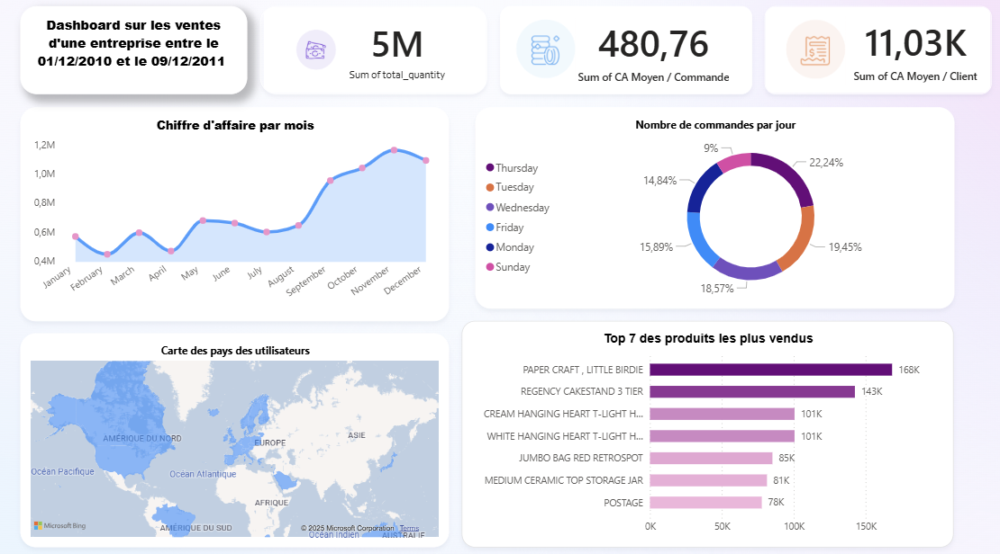

# 📊 Projet Data – Pipeline Batch & Dashboard BI

Ce projet simule un **pipeline batch analytique** pour le suivi des ventes e-commerce, en exploitant une **architecture moderne orientée BigQuery (OLAP)**. Il inclut la génération de **KPIs business** et leur visualisation dans **Power BI**.

---

## 🔧 Stack technique

- 🐍 **Python (pandas)** – Nettoyage & transformation
- ☁️ **Google BigQuery** – Entrepôt de données cloud (OLAP)
- 🧱 **dbt** – Modélisation en étoile (`dim_` & `fct_`)
- 📊 **Power BI** – Reporting visuel & exploration des données

---

## 🔁 Pipeline de traitement

1. 📥 Ingestion du fichier CSV (*Online Retail dataset*)
2. 🧹 Nettoyage et prétraitement avec un script Python
3. 🚀 Chargement des données dans **BigQuery**
4. 🧠 Modélisation analytique avec **dbt** :
   - `dim_customers`
   - `dim_products`
   - `fct_orders`
   - `fct_sales`
   - `kpi_sales`
5. 📈 Analyse et visualisation via **Power BI** connecté à **BigQuery**

---

## 📊 KPIs & Analyses générées

- 💶 **Chiffre d’affaires moyen par commande**
- 👤 **Chiffre d’affaires moyen par client**
- 📆 **Évolution mensuelle du chiffre d’affaires**
- 🔝 **Top 10 des produits les plus vendus**
- 📅 **Répartition des ventes par jour de semaine**
- 🌍 **Carte des clients par pays**

---

## 🧠 Objectifs pédagogiques

- Reproduire un **pipeline analytique d’entreprise** avec un entrepôt cloud
- Appliquer une architecture **moderne et scalable**
- Comprendre la distinction **OLTP vs OLAP**
- Développer des compétences en **ingénierie BI** avec `dbt` & Power BI

---

## 📷 Aperçu du Dashboard

---

## 👤 Auteur

**Amine SEKKAT**  
🎓 Étudiant en Master Data  
🚀 Passionné par la **Data Analytics** & l’**ingénierie BI**  
🔗 [GitHub – Tedsuno](https://github.com/Tedsuno)
